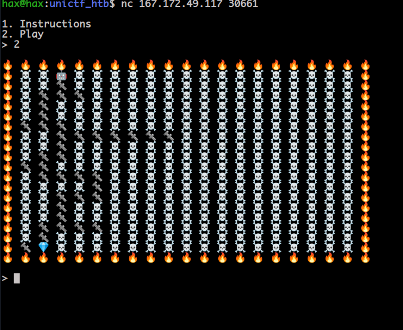
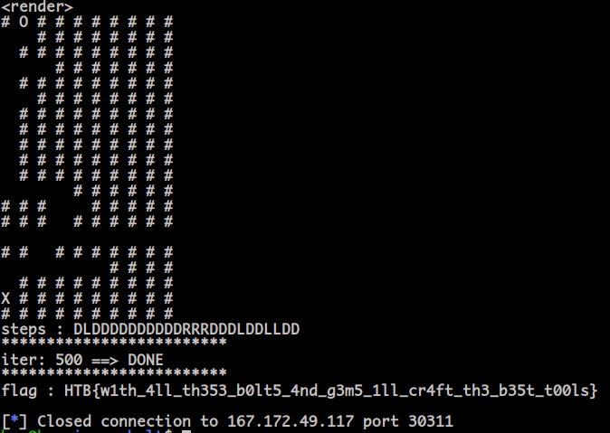

# **Insane Bolt (Misc) Writeup**
**Insane Bolt** was a **programming** challenge.

It was worth a total of **325 points** at the end of the ctf, rated with **medium** difficulty.

# Objective:

Connecting to the service, this is what we saw:

We were given a maze of emojis, including a **robot** (=>player) and a **gem** (=>objective).

We were asked to provide directions (ex. "DLLDRD")
so that the robot could reach the gem, while taking the shortest possible path.

The answer needed to be provided within a few seconds, and there were
**500** randomly generated levels we needed to pass in order to get the flag.

# An important observation

If we look at multiple generated mazes carefully, we can spot something;
There is **never** a need for the robot to move **UP** when it's navigating the maze.
Meaning, **it was possible to scan the whole maze without ever moving a square UP**.

This simplifies the problem a lot, since there is no need to use something like a 
**breadth-first-search** algorithm anymore.

# The logic used

We will have our robot navigate the maze in a certain way, until it finds
its way to the gem, while also keeping a record of the steps taken (ex. "DLRDDLLRD") to get to that point.
When the destination is reached, **removing any wasted moves from our steps will result
in the shortest path possible**.

For example, if we reach the gem after taking the steps **DDLLLRRRRDDLD**,
we only need to remove the wasted side movements and we get the solution:
**DDLLLRRRRDDLD ==> DDRDDLD** (removed LLLRRR, since they cancel each other out).

And there we have it. The code is available for more details.

